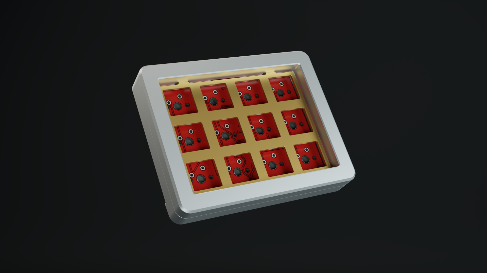
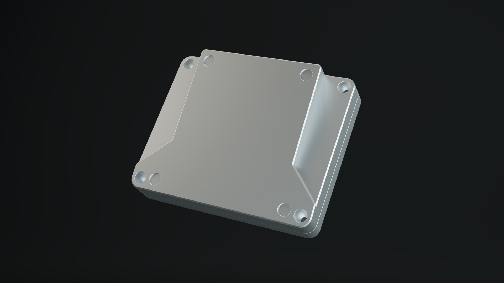

# Twelvekey

[![CC BY-NC-SA 4.0][cc-by-nc-sa-shield]][cc-by-nc-sa]

### Simple top-mount mechanical macropad case

---

[Files for 3D printing](print/)

[STEP](twelvekey.step)

[FBX (for rendering)](twelvekey.fbx)

[DXF platefile](twelvekey_plate.dxf)

[Technical drawings](twelvekey_drawing.pdf)

---

---

This work is licensed under a
[Creative Commons Attribution-NonCommercial-ShareAlike 4.0 International License][cc-by-nc-sa].

[![CC BY-NC-SA 4.0][cc-by-nc-sa-image]][cc-by-nc-sa]

[cc-by-nc-sa]: http://creativecommons.org/licenses/by-nc-sa/4.0/
[cc-by-nc-sa-image]: https://licensebuttons.net/l/by-nc-sa/4.0/88x31.png
[cc-by-nc-sa-shield]: https://img.shields.io/badge/License-CC%20BY--NC--SA%204.0-lightgrey.svg
