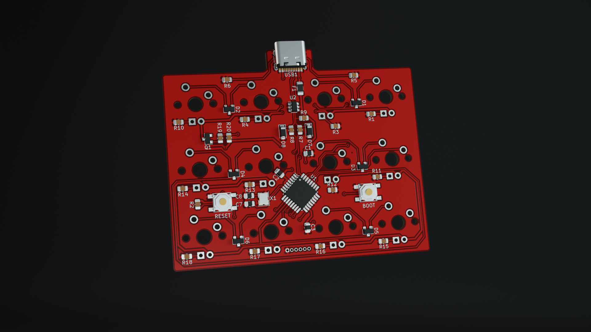
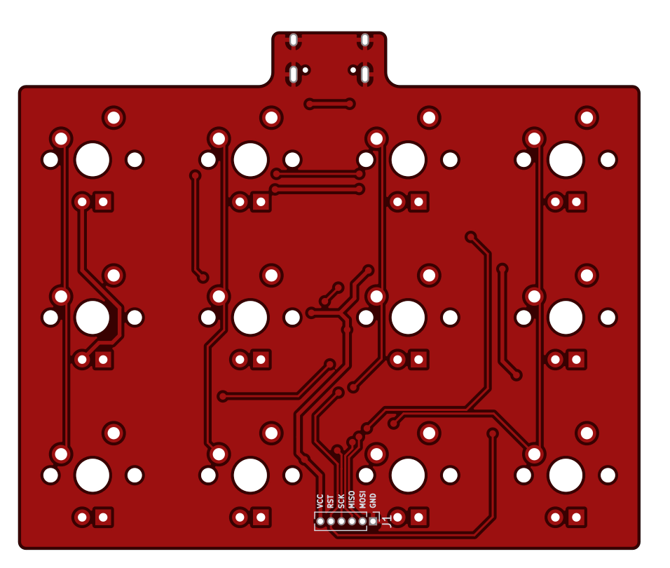
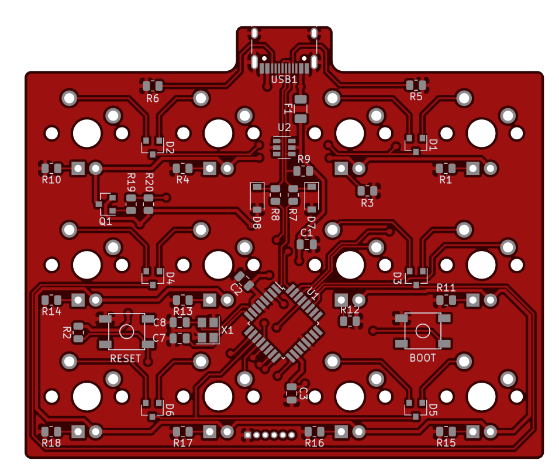

# Pad PCB

[![CC BY-NC-SA 4.0][cc-by-nc-sa-shield]][cc-by-nc-sa]

### Atmega328p based macropad PCB

---

[LCSC BOM](pcb.csv)

[JLC CPL](pcb-bottom-pos.csv)

[USB port](https://lcsc.com/product-detail/USB-Type-C_Korean-Hroparts-Elec-TYPE-C-31-M-12_C165948.html)

---

This work is licensed under a
[Creative Commons Attribution-NonCommercial-ShareAlike 4.0 International License][cc-by-nc-sa].

[![CC BY-NC-SA 4.0][cc-by-nc-sa-image]][cc-by-nc-sa]

[cc-by-nc-sa]: http://creativecommons.org/licenses/by-nc-sa/4.0/
[cc-by-nc-sa-image]: https://licensebuttons.net/l/by-nc-sa/4.0/88x31.png
[cc-by-nc-sa-shield]: https://img.shields.io/badge/License-CC%20BY--NC--SA%204.0-lightgrey.svg
